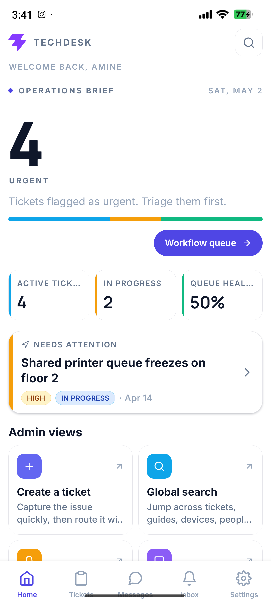

# TechDesk Mobile

TechDesk Mobile is the Android app for TechDesk, a private IT support and asset management platform. This public repository is for app downloads and screenshots only.

The source code is closed-source and is not published here.



## Download

- Android APK: [TechDesk-Mobile-arm64-final-techdesk-icon.apk](https://github.com/ilyassbourass/TechDesk-Mobile-Releases/releases/download/techdesk-mobile-v2026.05.02/TechDesk-Mobile-arm64-final-techdesk-icon.apk)
- Release page: [techdesk-mobile-v2026.05.02](https://github.com/ilyassbourass/TechDesk-Mobile-Releases/releases/tag/techdesk-mobile-v2026.05.02)
- APK size: about 24 MB
- Device target: ARM64 Android phones

Android may show a warning because this APK is installed directly instead of through the Play Store. On Xiaomi or Redmi devices, installing from the browser download flow can avoid USB-install security blocks.

## Backend

The app connects to the live TechDesk backend:

```text
https://techdesk-api-a6ty.onrender.com/api
```

## Test Accounts

All seeded demo accounts use the password `password`.

- Admin: `admin@techdesk.local`
- Technician: `tech1@techdesk.local`
- Employee: `employee1@techdesk.local`

## Build Notes

- Expo / React Native Android build
- Reduced ARM64 APK profile
- Final TechDesk launcher icon matching the web app
- Installed and launched on a connected Android phone before publication

## Source Code

The TechDesk source code remains private. This public repository intentionally contains only release documentation, screenshots, and downloadable app binaries.
